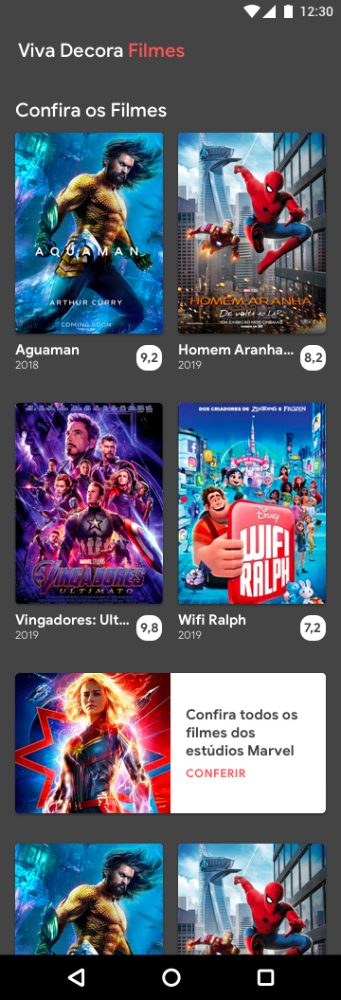
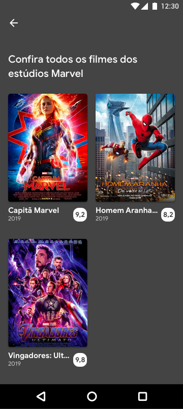
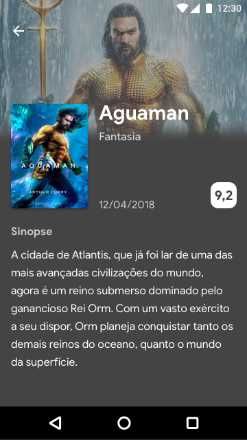

# Teste Android

Este teste é destinado para a vaga de desenvolvedor android. Não se preocupe: é um teste simples e não deve tomar muito do seu tempo.

Seu objetivo é desenvolver um aplicativo em Kotlin, contemplando  os objetivos principais listados abaixo:

## Objetivos principais:
* **[Objetivo 1](#objetivo-1)** - Exibir uma lista de filmes 
* **[Objetivo 2](#objetivo-2)** - A cada n filmes, exibir uma view customizada para promover filmes
* **[Objetivo 3](#objetivo-3)** - Ao clicar em um item dessa lista, mostrar a tela com os detalhes do filme

Os detalhes de cada objetivo estão listados abaixo:

## Objetivo 1
Exibir uma lista de filmes consultando a api versão **3** do **The Movies Database**. Esta lista deve ter paginação automática (scroll infinito) e cada request deve requisitar 16 itens.
* **Passo 1:** Obtenha uma key para utilizar a api neste [link](https://developers.themoviedb.org/3/getting-started/introduction).
* **Passo 2:** Obter os filmes obtidos no endpoint `/discover/movie`:

   ```https://api.themoviedb.org/3/discover/movie?api_key=<your_api_key>```
* **Passo 3:** Exibir os filmes seguindo o layout proposto abaixo:




## Objetivo 2
Queremos promover a visualização dos filmes da Marvel. Para isso devemos:
* Inserir um item (custom view) na lista de filmes. Este item irá se repetir a cada "n" filmes (exemplo: 4 filmes, item promocional, 4 filmes, item promocional...)
* O intervalo "n" pode ficar definido em uma variável com o valor inicial 4. Iremos testar esta funcionalidade com valores diferentes.
* Esse item deve ser exibido seguindo o layout sugerido abaixo:

  

Ao clicar neste item, devemos mostrar a lista de filmes com o termo sugerido.Para isso você deve obter os filmes neste endpoint:

```https://api.themoviedb.org/3/search/movie?query=marvel&api_key=<your_api_key>```

Exibir a lista obtida conforme o layout proposto abaixo:

  

Aqui também é esperado o scroll infinito, e 16 itens por requisição.
Utilizamos o termo *marvel* como sugestão. Sinta-se a vontade para promover outros filmes.

## Objetivo 3
Criar uma tela que exibe o detalhe do item. Esta tela deve seguir o layout proposto abaixo. Sinta-se a vontade para adicionar novos recursos.




Esta tela será exibida quando o item da lista for clicado, seja a lista do **[Objetivo 1](#objetivo-1)** ou do **[Objetivo 2](#objetivo-2)**.

## Plus:
* Clean Architecture
* Testes
* Tela com estados (*loading*, *error*, *success*)
* Seja criativo para surpreender-nos com o que desejar

## Entrega:
Faça seu teste em um repositório privado no GitHub, GitLab ou Bitbucket. Ao término você receberá instruções para adicionar um colaborador para avaliar seu teste.

### Asset para uso:


